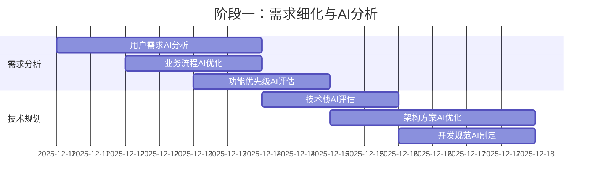
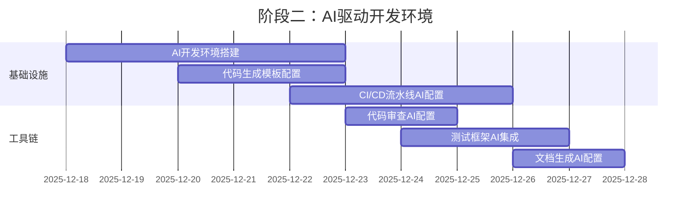
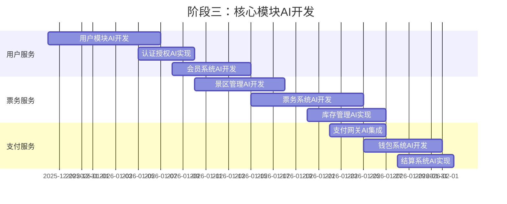
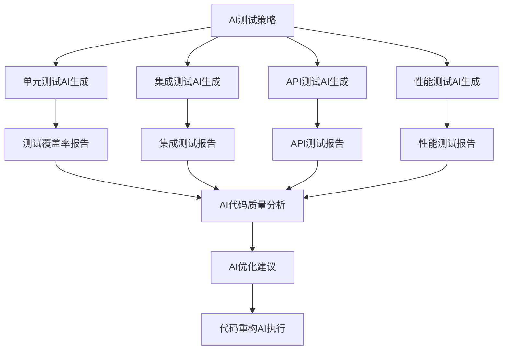
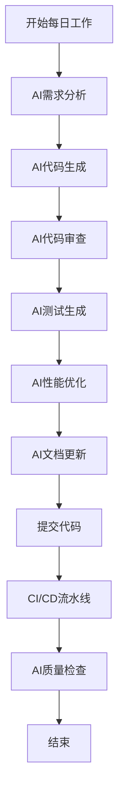

# 长治文旅平台 AI 开发实施方案与 To-Do List 框架

## 一、AI 开发策略概述

### 1.1 AI 开发优势利用

基于您计划的 AI 开发模式，我们将采用以下策略：

- **AI 辅助设计**：架构设计、代码生成、文档编写
- **AI 代码生成**：核心业务逻辑、测试用例、API 接口
- **AI 测试优化**：测试用例生成、性能测试、安全扫描
- **AI 运维监控**：日志分析、异常检测、性能优化

### 1.2 AI 工具选型

| 开发阶段     | 主要 AI 工具             | 辅助工具         | 应用场景             |
| ------------ | ------------------------ | ---------------- | -------------------- |
| **需求分析** | Claude Haiku 4.5/ChatGPT | Mermaid/Miro     | 需求梳理、流程图绘制 |
| **架构设计** | Claude Haiku 4.5/CodeGPT | PlantUML/Draw.io | 架构图、数据库设计   |
| **代码生成** | GitHub Copilot           | Cursor/Tabnine   | 业务代码、测试代码   |
| **测试生成** | ChatGPT/TestGPT          | Postman/Newman   | 测试用例、API 测试   |
| **文档编写** | Notion AI                | Docsie/GitBook   | 技术文档、用户手册   |
| **运维监控** | Datadog AI               | Prometheus AI    | 异常检测、性能优化   |

## 二、To-Do List 框架（AI 开发版）

### 2.1 阶段一：AI 辅助设计与规划（第 1-2 周）

#### 2.1.1 需求细化与 AI 分析



#### 2.1.2 具体任务清单

**优先级：P0（关键路径）**

| ID     | 任务名称             | AI 工具                     | 负责人  | 预期产出          | 完成标准         |
| ------ | -------------------- | --------------------------- | ------- | ----------------- | ---------------- |
| T1-001 | 需求文档 AI 优化     | Claude Haiku 4.5            | AI 助理 | 优化后的 PRD 文档 | 需求清晰、无歧义 |
| T1-002 | 用户旅程图 AI 生成   | ChatGPT + Mermaid           | AI 助理 | 用户旅程可视化    | 覆盖所有核心场景 |
| T1-003 | 技术栈 AI 评估报告   | Claude Haiku 4.5 + 代码分析 | AI 助理 | 技术选型建议书    | 包含对比分析     |
| T1-004 | 数据库设计 AI 优化   | ChatGPT + SQL 生成          | AI 助理 | 完整数据库设计    | ER 图、DDL 语句  |
| T1-005 | API 设计 AI 生成     | Postman AI                  | AI 助理 | API 接口规范      | Swagger 文档     |
| T1-006 | 项目目录结构 AI 生成 | GitHub Copilot              | AI 助理 | 项目骨架代码      | 包含最佳实践     |

**AI 提示词示例：**

```
请你作为资深架构师，为长治文旅平台设计一个渐进式四服务架构。
要求：
1. 基于Java技术栈（Spring Boot）
2. 支持日活10万用户
3. 包含用户服务、票务服务、支付服务、商户服务
4. 输出项目目录结构和核心配置文件
```

### 2.2 阶段二：AI 驱动开发环境搭建（第 3-4 周）

#### 2.2.1 开发环境配置



#### 2.2.2 具体任务清单

**优先级：P0**

| ID     | 任务名称                | AI 工具           | 负责人  | 预期产出            | 完成标准          |
| ------ | ----------------------- | ----------------- | ------- | ------------------- | ----------------- |
| T2-001 | AI 开发环境 Docker 配置 | ChatGPT + Docker  | AI 助理 | Dockerfile 全集     | 一键启动开发环境  |
| T2-002 | 代码生成模板创建        | GitHub Copilot    | AI 助理 | 代码模板库          | 支持 CRUD、API 等 |
| T2-003 | CI/CD 流水线 AI 生成    | GitHub Actions AI | AI 助理 | GitHub Actions 配置 | 自动化构建部署    |
| T2-004 | 数据库迁移脚本 AI 生成  | ChatGPT + SQL     | AI 助理 | 完整迁移脚本        | 支持版本回滚      |
| T2-005 | API Mock 服务 AI 创建   | Postman Mock AI   | AI 助理 | Mock API 服务       | 前端可独立开发    |
| T2-006 | 监控告警 AI 配置        | Prometheus AI     | AI 助理 | 监控告警规则        | 关键指标监控      |

**AI 提示词示例：**

```
请为Java（Spring Boot）项目创建一个完整的Docker开发环境配置，包括：
1. Dockerfile（多阶段构建，适用于 Spring Boot 可执行 jar）
2. docker-compose.yml（包含MySQL、Redis、Nginx）
3. .dockerignore 文件
4. 开发环境变量配置
要求支持热重载（Spring DevTools）和远程调试模式。
```

### 2.3 阶段三：核心模块 AI 开发（第 5-10 周）

#### 2.3.1 模块开发计划



#### 2.3.2 具体任务清单（用户服务示例）

**用户服务模块**
| ID | 任务名称 | AI 工具 | 代码量预估 | 测试覆盖率目标 |
|----|---------|--------|-----------|--------------|
| T3-U-001 | 用户模型 AI 生成 | ChatGPT + Java | 300 行 | 95% |
| T3-U-002 | 注册登录 API AI 生成 | GitHub Copilot | 500 行 | 98% |
| T3-U-003 | 短信验证码 AI 集成 | AI 代码生成 | 200 行 | 90% |
| T3-U-004 | JWT 认证中间件 AI 生成 | Claude Haiku 4.5 | 400 行 | 95% |
| T3-U-005 | 用户信息管理 API | Cursor AI | 600 行 | 96% |
| T3-U-006 | 地址管理模块 AI 开发 | ChatGPT | 400 行 | 94% |

**AI 提示词示例（用户注册）：**

```
请用Java基于Spring Boot实现用户注册功能，要求：
1. 使用 Spring Data JPA（Hibernate）连接 MySQL
2. 支持手机号+短信验证码注册
3. 密码加密存储（BCryptPasswordEncoder）
4. 输入参数验证（Jakarta Bean Validation）
5. 防重复注册检查
6. 返回 JWT token（使用 Spring Security + jjwt 或 Nimbus JOSE）
7. 完整的错误处理与统一异常处理器
8. 单元测试用例

请输出完整的代码文件，包括：
- `User.java`（实体/模型定义）
- `UserService.java`（业务逻辑）
- `UserController.java`（API 接口）
- `UserServiceTest.java`（单元测试，使用 JUnit5 + Mockito/AssertJ）
- 数据库迁移脚本（如 `V1__create_users_table.sql`）
```

### 2.4 阶段四：AI 测试与质量保障（第 11-12 周）

#### 2.4.1 测试策略



#### 2.4.2 具体任务清单

| ID     | 任务名称             | AI 工具         | 测试类型   | 目标覆盖率     |
| ------ | -------------------- | --------------- | ---------- | -------------- |
| T4-001 | 单元测试 AI 批量生成 | TestGPT         | 单元测试   | 90%+           |
| T4-002 | API 测试用例 AI 生成 | Postman AI      | API 测试   | 100%接口       |
| T4-003 | 性能测试脚本 AI 生成 | k6 AI           | 性能测试   | 模拟 5000 并发 |
| T4-004 | 安全测试 AI 扫描     | Snyk AI         | 安全测试   | 高危漏洞 0     |
| T4-005 | 压力测试 AI 配置     | Locust AI       | 压力测试   | 找出系统瓶颈   |
| T4-006 | 兼容性测试 AI 执行   | BrowserStack AI | 兼容性测试 | 主流浏览器     |

**AI 提示词示例（测试生成）：**

```
请为以下 Java 方法 生成完整的单元测试用例：

public User registerUser(RegisterRequest req) throws ServiceException {
  // 业务逻辑代码
}

要求：
1. 覆盖所有正常和异常情况
2. 使用参数化测试（若合适）
3. 包含边界测试
4. Mock 数据库/Repository 操作（使用 Mockito）
5. 测试并发场景（使用并发测试工具或多线程模拟）
6. 生成代码覆盖率报告

请使用 JUnit 5、Mockito 与 AssertJ 编写测试。
```

### 2.5 阶段五：部署上线与 AI 监控（第 13-14 周）

#### 2.5.1 部署策略

| 环境       | 部署方式       | AI 辅助工具        | 监控方案   |
| ---------- | -------------- | ------------------ | ---------- |
| 开发环境   | Docker Compose | ChatGPT 配置生成   | 基础监控   |
| 测试环境   | Kubernetes     | AI Helm chart 生成 | 完整监控   |
| 预生产环境 | K8s + 蓝绿部署 | AI 部署策略        | 性能监控   |
| 生产环境   | K8s + 滚动更新 | AI 运维脚本        | 全链路监控 |

#### 2.5.2 具体任务清单

| ID     | 任务名称             | AI 工具        | 产出物    | 成功标准     |
| ------ | -------------------- | -------------- | --------- | ------------ |
| T5-001 | K8s 部署配置 AI 生成 | ChatGPT + Helm | YAML 配置 | 一键部署     |
| T5-002 | 监控告警 AI 配置     | Prometheus AI  | 告警规则  | 关键指标监控 |
| T5-003 | 日志收集 AI 配置     | Loki AI        | 日志管道  | 全链路追踪   |
| T5-004 | 备份策略 AI 制定     | ChatGPT        | 备份脚本  | RPO/RTO 达标 |
| T5-005 | 安全加固 AI 建议     | Snyk AI        | 安全配置  | 通过安全扫描 |
| T5-006 | 性能优化 AI 分析     | Datadog AI     | 优化报告  | 性能提升 30% |

## 三、AI 开发工作流程

### 3.1 每日 AI 开发流程



### 3.2 AI 协同开发规范

#### 3.2.1 代码生成规范

```yaml
ai_code_generation:
  prompt_template: |
    你是一个资深{language}开发工程师，请为{project_name}项目开发{feature}功能。

    项目背景：长治文旅大生态服务平台
    技术栈：{tech_stack}
    数据库：MySQL 8.0 + Redis 7.0

    要求：
    1. 代码符合{code_style}规范
    2. 包含完整的错误处理
    3. 添加必要的注释
    4. 包含单元测试
    5. 考虑性能优化
    6. 注意安全防护

    请输出完整的代码文件。

  validation_rules:
    - 必须通过静态代码分析
    - 必须通过单元测试
    - 必须通过安全扫描
    - 必须通过性能测试
```

#### 3.2.2 代码审查 AI 助手配置

```python
# AI代码审查配置
class AICodeReviewer:
    def __init__(self):
        self.rules = {
            'security': [
                'sql_injection',
                'xss_vulnerability',
                'sensitive_data_exposure',
                'insecure_deserialization'
            ],
            'performance': [
                'n_plus_one_query',
                'memory_leak',
                'inefficient_algorithm',
                'blocking_operations'
            ],
            'maintainability': [
                'code_complexity',
                'duplicate_code',
                'long_method',
                'large_class'
            ]
        }

    def review_code(self, code):
        """AI代码审查"""
        issues = []

        # 安全审查
        security_issues = self.check_security(code)
        issues.extend(security_issues)

        # 性能审查
        performance_issues = self.check_performance(code)
        issues.extend(performance_issues)

        # 可维护性审查
        maintainability_issues = self.check_maintainability(code)
        issues.extend(maintainability_issues)

        return issues

    def generate_fix_suggestions(self, issues):
        """AI生成修复建议"""
        suggestions = []
        for issue in issues:
            prompt = f"""
            代码问题：{issue['description']}
            问题代码：{issue['code_snippet']}
            请提供修复建议和示例代码。
            """
            suggestion = ai_assistant.ask(prompt)
            suggestions.append(suggestion)

        return suggestions
```

## 四、风险管理与 AI 辅助

### 4.1 AI 开发风险识别

| 风险类型         | 风险描述              | AI 辅助解决方案   | 责任人     |
| ---------------- | --------------------- | ----------------- | ---------- |
| **代码质量风险** | AI 生成代码质量不稳定 | 多轮迭代+人工审核 | 开发负责人 |
| **安全漏洞风险** | AI 可能引入安全漏洞   | 自动化安全扫描    | 安全工程师 |
| **性能问题风险** | AI 代码性能不佳       | 性能测试+优化     | 性能工程师 |
| **知识产权风险** | AI 生成代码版权问题   | 代码原创性检查    | 法务顾问   |
| **团队依赖风险** | 过度依赖 AI 降低技能  | 混合开发模式      | 技术经理   |

### 4.2 AI 质量保障机制

```yaml
quality_assurance:
  ai_development_cycle:
    - step: 需求分析
      ai_tool: Claude Haiku 4.5/ChatGPT
      validation: 人工评审

    - step: 架构设计
      ai_tool: PlantUML AI
      validation: 架构评审会

    - step: 代码生成
      ai_tool: GitHub Copilot
      validation: 自动化测试

    - step: 测试生成
      ai_tool: TestGPT
      validation: 测试覆盖率

    - step: 文档编写
      ai_tool: Notion AI
      validation: 文档评审

    - step: 部署运维
      ai_tool: ChatGPT + Terraform
      validation: 监控告警

  quality_gates:
    - gate: 代码审查
      tools: [SonarQube, CodeClimate]
      threshold: A级评级

    - gate: 测试覆盖率
      tools: [Maven/Gradle test, JaCoCo]
      threshold: 90%+

    - gate: 安全扫描
      tools: [Snyk, OWASP ZAP]
      threshold: 无高危漏洞

    - gate: 性能测试
      tools: [k6, JMeter]
      threshold: P95 < 500ms
```

## 五、进度跟踪与 AI 报告

### 5.1 每日进度 AI 跟踪

```python
class AIDailyReport:
    def generate_daily_report(self):
        """AI生成每日开发报告"""
        report = {
            'date': datetime.now().strftime('%Y-%m-%d'),
            'progress': self.calculate_progress(),
            'code_metrics': self.get_code_metrics(),
            'test_results': self.get_test_results(),
            'issues_found': self.get_issues(),
            'ai_assistance': self.get_ai_usage(),
            'next_steps': self.suggest_next_steps()
        }

        return self.format_report(report)

    def calculate_progress(self):
        """AI计算项目进度"""
        # 分析Git提交、任务完成情况等
        pass

    def suggest_next_steps(self):
        """AI建议下一步工作"""
        prompt = """
        基于当前项目状态：
        已完成：{completed_tasks}
        进行中：{in_progress_tasks}
        阻塞问题：{blocking_issues}

        请建议最优先的3个任务。
        """
        return ai_assistant.ask(prompt)
```

### 5.2 每周 AI 复盘会议

**会议议程：**

1. **AI 开发效率分析**（15 分钟）

   - 代码生成速度
   - 问题解决率
   - AI 辅助效果

2. **代码质量 AI 报告**（20 分钟）

   - 测试覆盖率变化
   - 代码复杂度趋势
   - 安全漏洞统计

3. **下周 AI 开发计划**（25 分钟）
   - 重点模块 AI 开发
   - AI 工具优化建议
   - 风险预防措施

## 六、立即行动项

### 6.1 本周启动任务（P0 优先级）

| 任务 ID    | 任务名称                   | 预计耗时 | 产出物                  | 开始时间 |
| ---------- | -------------------------- | -------- | ----------------------- | -------- |
| **AI-001** | 搭建 AI 开发环境           | 2 天     | Docker 环境 + AI 工具链 | 明天     |
| **AI-002** | 创建项目骨架代码           | 1 天     | 完整项目结构            | 后天     |
| **AI-003** | 配置 CI/CD 流水线          | 1 天     | GitHub Actions 配置     | 后天     |
| **AI-004** | 生成第一个模块（用户服务） | 3 天     | 可运行的用户模块        | 大后天   |
| **AI-005** | 设置代码质量门禁           | 0.5 天   | SonarQube 配置          | 明天     |

### 6.2 第一步具体操作指南

**步骤 1：环境准备**

```bash
# 1. 安装必要工具
brew install docker git python nodejs

# 2. 配置AI开发工具
pip install openai anthropic
npm install -g @githubnext/github-copilot-cli

# 3. 创建项目目录
mkdir changzhi-cct-hub && cd changzhi-cct-hub

# 4. 初始化Git仓库
git init
git branch -M main
```

**步骤 2：使用 AI 生成基础配置**

```
AI提示词：
请为长治文旅平台创建一个完整的 Java (Spring Boot) 项目基础结构，要求：
1. 使用 Java 17+，Spring Boot 框架
2. 包含用户服务、票务服务、支付服务、商户服务四个模块
3. 每个模块包含：entity、service、controller、repository 层
4. 包含 Dockerfile、docker-compose.yml、Maven/Gradle 构建脚本
5. 包含 `.env.example` 配置文件
6. 包含基础的中间件/组件（日志、认证（Spring Security）、CORS 等）
7. 包含 Swagger / OpenAPI 配置

请输出完整的项目结构。
```

**步骤 3：验证环境**

```bash
# 1. 启动开发环境
docker-compose up -d

# 2. 运行代码生成测试
make generate-user-module

# 3. 运行测试
make test

# 4. 启动服务
make run
```

## 七、总结

### 7.1 AI 开发关键成功因素

1. **清晰的 AI 提示词** - 决定代码质量的关键
2. **合理的迭代流程** - AI 生成+人工优化的循环
3. **严格的质量门禁** - 自动化测试+安全扫描
4. **持续的技能提升** - 保持团队对 AI 工具的理解

### 7.2 预期收益

| 指标       | 传统开发 | AI 辅助开发      | 提升幅度        |
| ---------- | -------- | ---------------- | --------------- |
| 开发速度   | 1x 基准  | 2-3 倍           | 100-200%        |
| 代码质量   | 人工审查 | 自动检查+AI 优化 | 缺陷率降低 50%  |
| 测试覆盖率 | 手动编写 | AI 批量生成      | 覆盖率达到 90%+ |
| 文档完整性 | 后补文档 | AI 同步生成      | 文档及时率 100% |

### 7.3 下一步建议

**立即开始：**

1. 按照 6.2 节配置开发环境
2. 使用提供的 AI 提示词生成项目骨架
3. 建立每日 AI 开发工作流

**后续扩展：**

1. 根据实际进展调整 AI 工具组合
2. 建立 AI 代码审查和质量保障流程
3. 持续优化 AI 提示词和开发模板

**需要您确认：**

1. 是否同意这个 AI 开发实施方案？
2. 是否需要调整任何时间节点？
3. 是否有特定的技术栈偏好？
4. 是否需要增加特定的 AI 工具？
